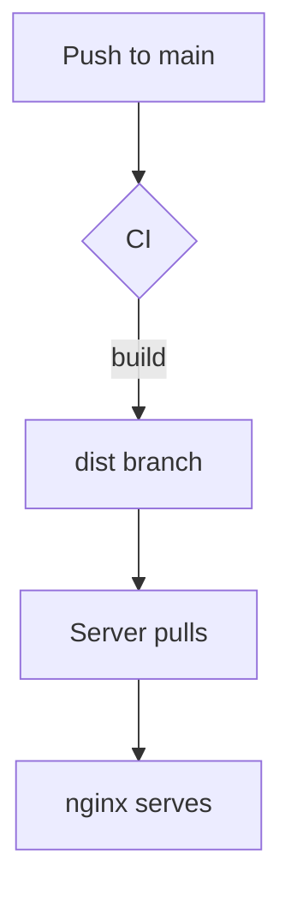
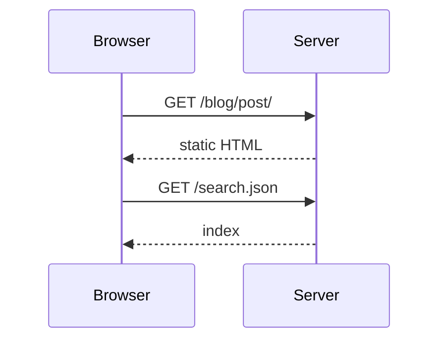

Mermaid diagrams render client-side, from a self-hosted bundle, only on pages
that contain one.

## Flowchart

```mermaid
flowchart TD
    A[Push to main] --> B{CI}
    B -->|build| C[dist branch]
    C --> D[Server pulls]
    D --> E[nginx serves]
```

## Sequence

```mermaid
sequenceDiagram
    Browser->>Server: GET /blog/post/
    Server-->>Browser: static HTML
    Browser->>Server: GET /search.json
    Server-->>Browser: index
```
